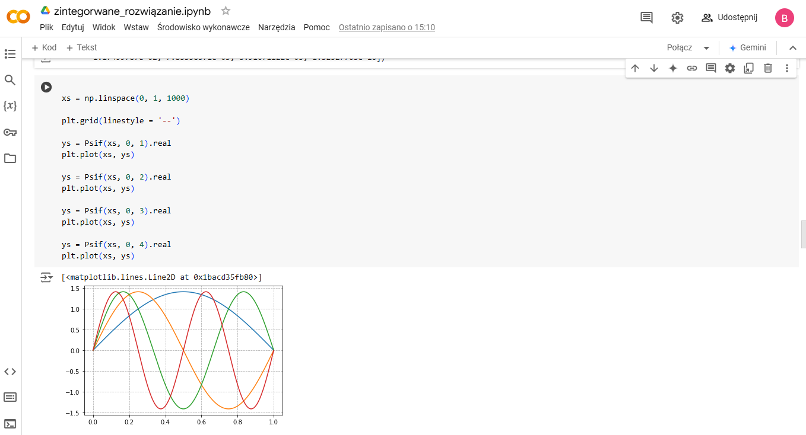

# Quantum Mechanics Problem-Solving
This Jupyter Notebook is designed to solve key problems in quantum mechanics, using Python's symbolic and numerical libraries like SymPy, NumPy, and Matplotlib. It provides analytical and computational tools to investigate wave functions, momentum, energy, and other properties.



## Key Problems Solved

### 1. **Expectation Values**
   - **Objective**: Compute expectation values of physical quantities such as momentum (`<p>`), squared momentum (`<p^2>`), and validate the uncertainty principle.
   - **Approach**:
     - Use symbolic differentiation and integration to find analytical forms.
     - Implement numerical techniques for specific wavefunctions and boundary conditions.

### 2. **Wave Equation Solutions**
   - **Objective**: Solve the Schrödinger equation for specific potentials and conditions.
   - **Approach**:
     - Symbolically represent wavefunctions and solve using SymPy's equation solvers.
     - Visualize solutions with Matplotlib to understand spatial and temporal behavior.

### 3. **Uncertainty Principle Validation**
   - **Objective**: Verify whether the uncertainty principle holds for derived wavefunctions.
   - **Approach**:
     - Compute `<p>` and `<p^2>` and validate the inequality \(\Delta x \cdot \Delta p \geq \hbar / 2\).

### 4. **Dynamic Animations**
   - **Objective**: Create animations to depict the evolution of quantum states over time.
   - **Approach**:
     - Use `FuncAnimation` from Matplotlib for dynamic visualizations.

## Dependencies

Ensure the following libraries are installed:
```bash
pip install sympy numpy matplotlib
```

## Code Structure

1. **Initialization**: Import libraries and define key symbolic variables such as `x`, `k`, `a`, `n`, `m`, `h` (Planck's constant), and `t` (time).
2. **Problem-Specific Sections**:
   - Analytical derivations for momentum operators.
   - Numerical simulations for specific scenarios.
3. **Visualization**:
   - Use plots and animations to represent findings.

## How to Run

To execute this notebook and interact with its functionalities, open `.ipynb` file in environemnt like Google Collab and execute each cell or follow theses steps:

1. **Install Python**:  
   Ensure you have Python 3.8.8 or a compatible version installed on your machine. You can download Python from [python.org](https://www.python.org/).

2. **Install Jupyter Notebook**:  
   If you don’t already have Jupyter Notebook installed, use the following command to install it:
   ```bash
   pip install notebook
   ```
3. **Clone or Download the Notebook:**:
Save the notebook file `zintegorwane_rozwiązanie.ipynb` to a folder on your computer.

4. **Open the Notebook**:  
   Navigate to the folder containing the notebook and run the following command to open Jupyter Notebook:
   ```bash
   jupyter notebook
   ```
   This will open a web interface in your default browser.

5. **Run the Notebook**:
   - Click on `zintegorwane_rozwiązanie.ipynb` in the Jupyter interface to open it.
   - Execute each cell sequentially by selecting it and pressing **Shift + Enter**.
   - Follow the instructions and prompts in the markdown cells.

6. **Modify and Explore**:
   - Customize input parameters (e.g., wavefunctions, boundary conditions) within the code cells to explore different quantum scenarios.
   - Re-run cells after making changes to see updated results.

## Example Solutions

### Example 1: Solve Schrödinger Equation
```python
from sympy import symbols, Function, Eq, solve

x, k, psi = symbols('x k'), Function('psi')
eq = Eq(psi(x).diff(x, x), -k**2 * psi(x))
solution = solve(eq, psi(x))
print(solution)
```

### Example 2: Compute Expectation Values
```python
from sympy import integrate

# Wavefunction squared (example)
wavefunction = sp.exp(-x**2)
prob_density = wavefunction**2

# Expectation value of x
expectation_x = integrate(x * prob_density, (x, -sp.oo, sp.oo))
print(expectation_x)
```
